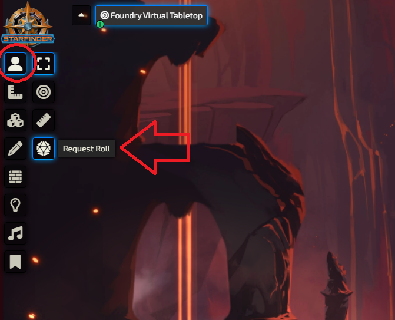
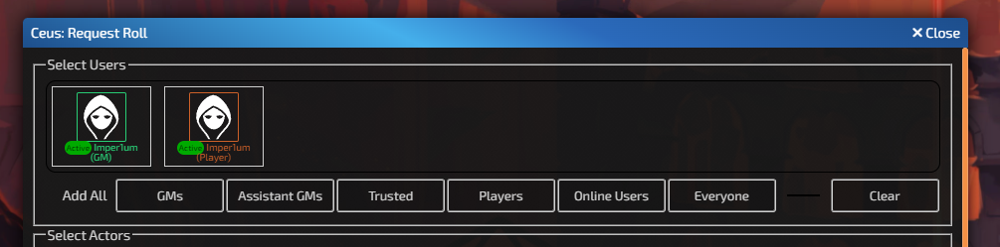
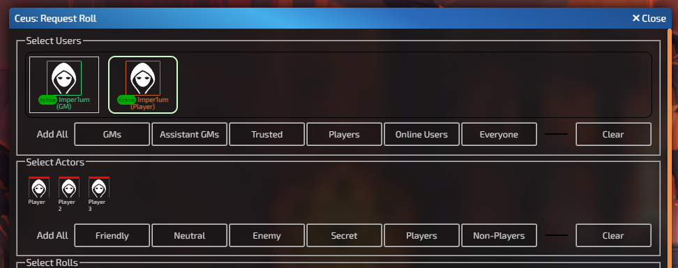
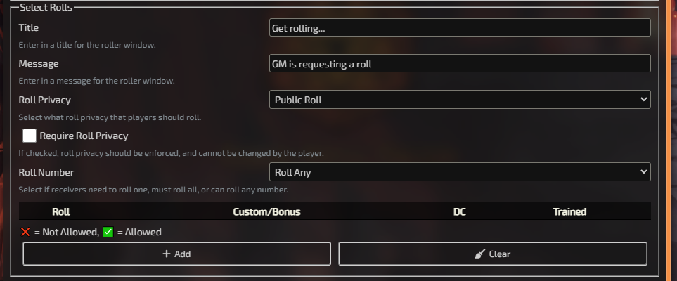
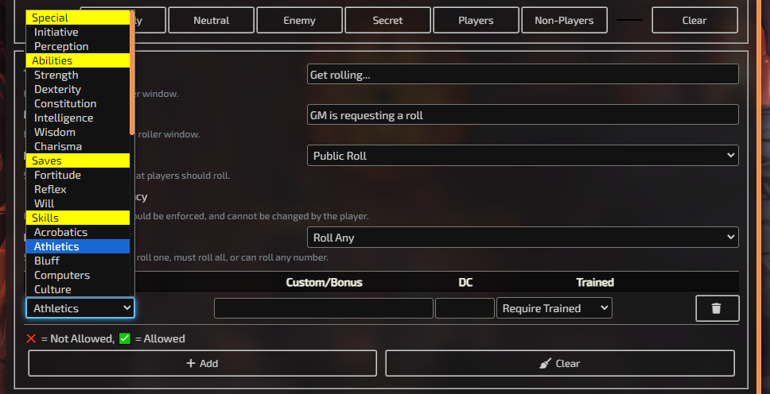
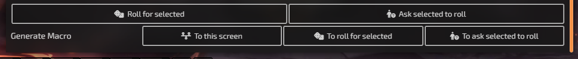
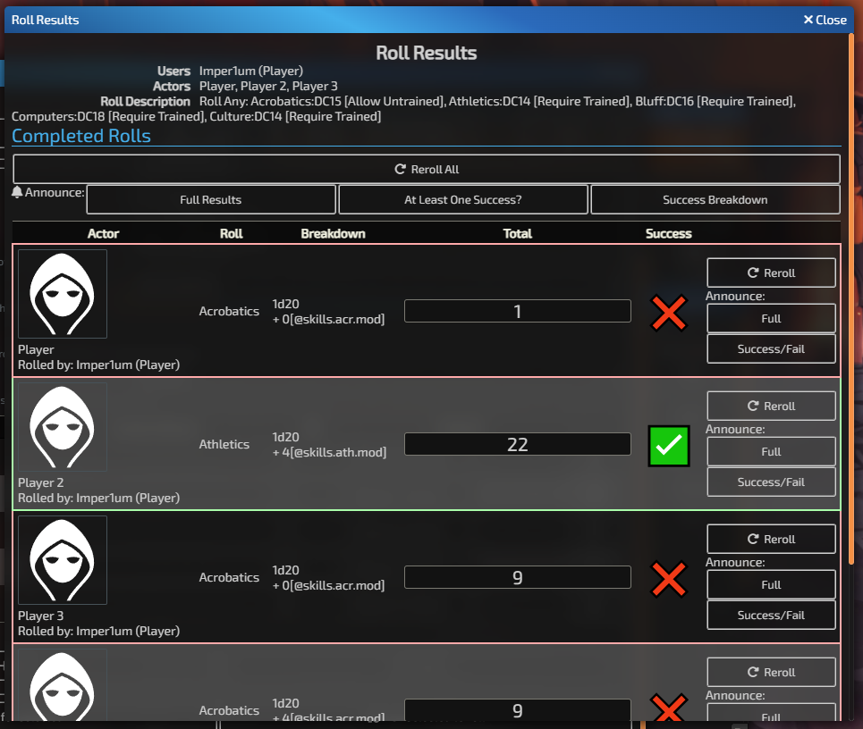

# How to Use Ceus
Ceus is kept as simple as possible for players, while affording many options for GMs.

## Opening Ceus
**NOTE:** This module's editor menu can only be seen by GMs.

Ceus' GM Interface can be accessed from the Token Controls > Request Roll button.

If you cannot see this button, you (probably):
- are running Ceus with a ruleset that is incompatible with Ceus
- have another module that is conflicting with Ceus. Ceus is generally compatible with almost every module, but if you have a module takes control of the Token Controls drop down.
- haven't enabled Ceus from the Manage Modules screen.

## Selecting Users

Once you have opened the Ceus interface, you should see every user that is attached to this Foundry instance. You can click on individual players or you can click on the Add All buttons to add specific types of people.

**NOTE:** The Active Tag is not automatically updating at this time. The Active tag only applies from when the screen is opened.

## Selecting Actors

After you have selected at least one user, every actor that the selected users *could* have ownership to will appear in the Select Actors area.

Each actor has a colored line above their image that denotes their disposition (Red = Enemy, Yellow = Neutral, Green = Friendly, Purple = Secret). You may select individual actors, or you may select groups of actors by using the Add All Buttons.

**NOTE:** When you select multiple users, it will show all of the actors that any of the users selected have ownership to. For GMs, they have ownership to all actors.

## Configuring the Roll screen

Options in this area allow you to customize what players will see.

### Roll Privacy
Ceus allows roll privacy to be enforced, if your ruleset is setup for it. When a player attempts to roll, it will override the settings when the player rolls:
- Public Rolls will display the results of the roll to everyone
- Blind GM Rolls will display that a roll was made, but only GMs will see the result
- GM Rolls will display the roll to only the user that rolled it and all GMs.
- Self Rolls will only display the roll to the user that rolled it.

**NOTE:** Regardless of roll privacy, the GM that launches this roll will be able to see the result of the roll in the results window.

### Roll Number
Ceus allows for GMs to configure how many rolls can be made per Actor.
- In Roll Any mode, players will be able to roll one, some, or all rolls given per Actor (at their discretion).
- In Roll Only One mode, players will be able to roll only one of the available rolls per Actor.
- In Roll All mode, players must roll all rolls. The screen can be closed by players at any time, and there is no restriction forcing players to click any rolls, this is just a display option.

## Selecting Rolls

GMs can choose any type of generic roll for the specific ruleset selected. GMs may add as many (or as little) rolls as they want to.

### Custom/Bonus
This will be added (by default) to the roll. If your ruleset system requires that there is a popup for the roll, anything typed here should be automatically added to the bonus part.

### Advantage/Disadvantage
If your system allows for configuring Advantage and Disadvantage, you may select what players can select (Normal/Advantage/Disadvantage).

### DC (Difficulty Class)
GMs can enter in a Difficulty Class (DC) that is the target number that a player must meet in order to succeed at that specific roll. The DC is not displayed to players until they complete their roll.

### Trained
If your system has the options, you may select how a roll should be displayed depending on the Trained State of the roll.
- With Require Trained, rolls that require a skill, attribute, or option that the character is not trained in will not be displayed.
- With Prevent Trained, when a player attempts to roll a skill, attribute, or option that the character is not trained in, they will see a warning that asks them if they wish to still roll.
- With Allow Untrained, players will be able to roll the roll, regardless of their trained status.

Systems without a configurable Trained status will always roll in Always Untrained mode. Rolls may be setup in a way that if a roll does not require training, but Require Trained is selected, it will not hide or put the roller on notice about the untrained option.

### Helpful Considerations
- Roll requests will be sent to all users that were selected. Roll requests will only show for Actors the User has ownership over (or if they are GM).
- Its not possible to have one roll option go to one user/actor, and have another separate option for another user/actor. Those are separate calls to the Ceus system. (So, you can't have a Grappler roll a Grapple check while a defender roll an Escape Artist or Reflex save in the same screen)
- As a GM, you will be able to modify rolls after receiving them. Helpful if you have a Circumstance bonus that you don't want to disclose to the party.
- Each roll can only be rolled once per actor. Once a roll has been completed for an actor, all other user's Ceus Player Request screens will update to reflect that the roll has already been completed by another user. In the event that two rolls are received for the same actor/roll combination, only the first roll will be considered.

## Sending Rolls

Once you have configured your roll, you have five options for sending rolls.

### Roll for Selected
This option will show the roll screen for only the user executing the Ceus Roll screen. All the possible rolls for all of the selected actors will be queued up for the GM to roll, and, afterwards, it display the results. Helpful if you want to make secret Perception checks (just make sure to remember Self Roll!)

### Ask Selected to Roll
This option will show the results screen and send a roll request to all the users selected.

### Generate Macro: To this screen
This will build a custom macro that will pop up. This macro, when called, will display the Ceus: Request Roll screen (this screen), with all of the options previously selected.

### Generate Macro: To roll for selected
This will build a custom macro that will pop up. This macro, when called, will show the results screen and show to the macro runner the roll screen.

### Generate Macro: To ask selected to Roll
This will build a custom macro that will pop up. This macro, when called, will show the results screen, and ask all of the specified users to roll the selected rolls.

## Roll Results

After a roll request has been sent, a roll results screen will show to the user that requested the roll.

As users complete their rolls, their results will appear on this screen. If a DC has been set, it will automatically show if a result total exceeds the DC set. It will show who rolled the roll, what roll they selected, the breakdown (if the ruleset provides it), and the total roll.

### Re-Notify Rollers
If your player has reported they accidentally closed the screen or refreshed their screen, you may select the "Notify" option, which will show the rolling screen for all users that are attached to that actor (or all actors on the roll).

### Cancel Rolls
Cancelling rolls will shut down roll options for players. This is useful if you made a roll mistake.

### Rolling
At any point in time, a GM can select that they want to roll for a player. This will show the roll screen to the GM that clicked the button and allow them to roll as the Actor. 

**NOTE:** This roll screen has the same restrictions as all the other roll request screens: it will not allow a second roll for the same actor/roll combination.

### Rerolling
After a roll has been received, a GM may select the reroll option. This will send a notification to all attached users that a roll has been requested.

### Editing Rolls
GMs may edit the totals at any time. Doing so will set the roll to "GM Fiat," and it will discard everything in the roll. It will also update the success/fail condition (if a DC has been set). Players will not be notified of any changes to this roll.

### Announcing results
At any time, announcements can be made for a single roll, or all rolls.

- Full Results: This will show to all players a breakdown of all of the rolls that were received by Ceus, including totals.
- At Least One Success?: This will show a pass if *any* of the rolls were a success, regardless of character.
- Success Breakdown: This will show a breakdown of every actor and show if they succeeded at least once, or all of their rolls were failures. This will not show totals, or what roll succeeded or failed, just which Actors succeeded and which failed.
- Success/Fail: This will show if a single roll was a success or failure. It will not show the total or DC.